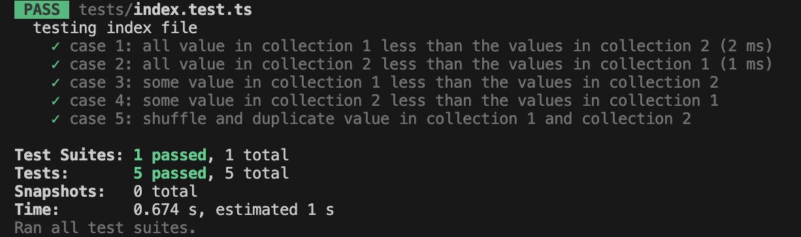

# TypeScript-Assignment

[This repository](https://github.com/Harizt/TypeScript-Assignment) contains the
solution and test case for merging two sort array assignments.

## Quick start

1. `npm install --save-dev` to install the dependencies. If you don't install npm on your working environment yet please follow this guide [TypeScript tutorial in Visual Studio Code](https://code.visualstudio.com/docs/typescript/typescript-tutorial) and [TypeScript Unit Testing 101: A Developer’s Guide](https://www.testim.io/blog/typescript-unit-testing-101/).
2. `npm test`: to run all test cases which provide in `index.test.ts` file.
3. If you perform all the steps mentioned above correctly, you will obtain a result like this.
